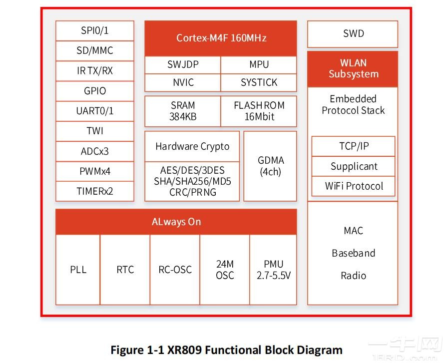

# [XR809](https://doc.soc.xin/XR809)

* [Xradio](http://www.xradiotech.com/): [Cortex-M4F](https://github.com/SoCXin/Cortex)
* [L3R3](https://github.com/SoCXin/Level): 160 MHz

### [简介](https://www.espressif.com/en/news/XR809)

[XR809](https://github.com/XradioTech/XR809SDK) 

#### 关键参数

* 160 MHz Cortex-M4F
* 384KB SRAM
* IEEE 802.11b/g/n

### [资源收录](https://github.com/SoCXin)

* [参考资源](src/)
* [参考文档](docs/)
* [参考工程](project/)

### [选型建议](https://github.com/SoCXin/XR809)

[XR809](https://github.com/SoCXin/XR809) 

### [www.SoC.xin](http://www.SoC.Xin)
